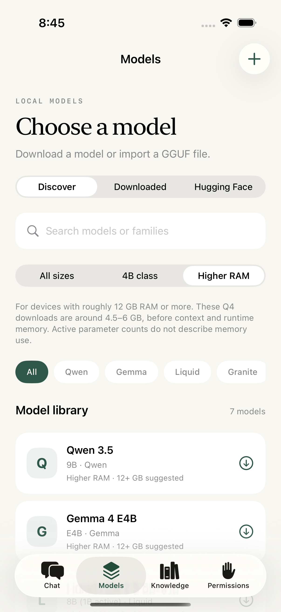
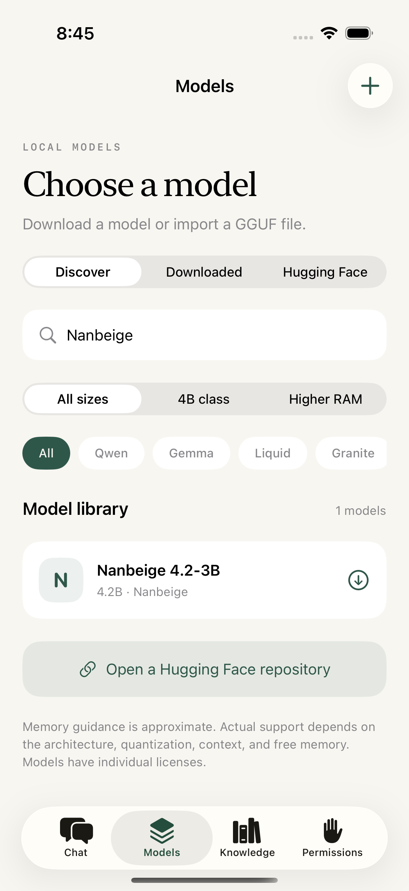

# Models from the mobile benchmark chart

## September 7 additions from the Intelligence screenshot

The catalogue now has **39 distinct repositories**. Added the three missing releases, verified against live Hugging Face metadata on September 7, 2026:

| Release | GGUF publisher | Default download | Total parameters reported by GGUF | Suggested RAM |
| --- | --- | --- | --- | --- |
| MiniCPM5-2B | [OpenBMB, official](https://huggingface.co/openbmb/MiniCPM5-2B-GGUF) | Q4_K_M · 1.56 GB | 2.52B | 6+ GB |
| Nanbeige4.1-3B | [Mungert, community](https://huggingface.co/Mungert/Nanbeige4.1-3B-GGUF) | Q4_K_M · 2.58 GB | 3.93B | 8+ GB |
| Nemotron 3 Nano 4B | [NVIDIA, official](https://huggingface.co/nvidia/NVIDIA-Nemotron-3-Nano-4B-GGUF) | Q4_K_M · 2.84 GB | 3.97B | 8+ GB |

Checked revisions: MiniCPM `8ffce1833680`, Nanbeige `7a35d8054f29`, NVIDIA `ba223d14e455`. All three are public single-file downloads with SHA-256 metadata. MiniCPM and Nanbeige cards declare Apache-2.0; NVIDIA uses its Nemotron Open Model License, not an OSI-license claim. `llama` and `nemotron_h` handlers exist in bundled b10830. These new weights have not been inference-tested on an iPhone; architecture support and download availability alone do not certify compatibility.

Already present: G9v3 3B, Granite 4.2 3B, MiniCPM5 1B, Liquid LFM2.5 2.6B, Phi 4 Mini, and Qwen3.5 0.8B/2B. Reasoning/non-reasoning bars do not become duplicate downloads. Scores from the screenshot are not presented as app benchmarks. The new Nanbeige and Nemotron entries join the 3.5–4.5B size class; MiniCPM keeps its release name and explains its larger total parameter count.

## September 6 additions

Checked September 6, 2026 against Hugging Face repository metadata and the bundled llama.cpp b10830 architecture registry. The user's Artificial Analysis screenshot measures a **Galaxy S26 Ultra**, a 1,024-token input, a 256-token response, and a maximum 16K evaluation context. It is not an iPhone performance test. No benchmark scores, latency promises, or rankings were copied into the app.

Fourteen entries were added, bringing the curated library to 36. Every repository below exposes a single-file text GGUF at the listed default quantization. Vision projectors, MTP sidecars, and split weights are not selected. File sizes are decimal GB, rounded; the app fetches exact sizes and checksums and pins revisions when downloading.

| Added model | GGUF source | Default | Download | Suggested device RAM |
| --- | --- | --- | ---: | ---: |
| LFM 2.5 350M | [LiquidAI](https://huggingface.co/LiquidAI/LFM2.5-350M-GGUF) | Q4_K_M | 0.23 GB | 4+ GB |
| LFM 2.5 1.2B Instruct | [LiquidAI](https://huggingface.co/LiquidAI/LFM2.5-1.2B-Instruct-GGUF) | Q4_K_M | 0.73 GB | 4+ GB |
| LFM 2 2.6B Experimental | [LiquidAI](https://huggingface.co/LiquidAI/LFM2-2.6B-Exp-GGUF) | Q4_K_M | 1.64 GB | 6+ GB |
| Granite 4.0 350M | [IBM](https://huggingface.co/ibm-granite/granite-4.0-350m-GGUF) | Q4_K_M | 0.24 GB | 4+ GB |
| MiniCPM 5 1B | [OpenBMB](https://huggingface.co/openbmb/MiniCPM5-1B-GGUF) | Q4_K_M | 0.69 GB | 4+ GB |
| Nanbeige 4.2-3B | [bartowski](https://huggingface.co/bartowski/Nanbeige_Nanbeige4.2-3B-GGUF) | Q4_K_M | 2.68 GB | 8+ GB |
| G9v3 3B | [bartowski](https://huggingface.co/bartowski/ai9stars_G9v3-3B-GGUF) | Q4_K_M | 1.90 GB | 6+ GB |
| Ling 3.0 Tiny | [bartowski](https://huggingface.co/bartowski/Ling-3.0-tiny-GGUF) | Q4_K_M | 4.92 GB | 12+ GB |
| LFM 2.5 8B-A1B | [LiquidAI](https://huggingface.co/LiquidAI/LFM2.5-8B-A1B-GGUF) | Q4_K_M | 5.16 GB | 12+ GB |
| Gemma 4 E4B | [Google QAT](https://huggingface.co/google/gemma-4-E4B-it-qat-q4_0-gguf) | Q4_0 | 5.15 GB | 12+ GB |
| Qwen 3.5 9B | [Unsloth](https://huggingface.co/unsloth/Qwen3.5-9B-GGUF) | Q4_K_M | 5.68 GB | 12+ GB |
| Granite 4.1 8B | [IBM](https://huggingface.co/ibm-granite/granite-4.1-8b-GGUF) | Q4_K_M | 5.35 GB | 12+ GB |
| Falcon H1R 7B | [TII](https://huggingface.co/tiiuae/Falcon-H1R-7B-GGUF) | Q4_K_M | 4.60 GB | 12+ GB |
| Ornith 1.0 9B | [Ornith AI](https://huggingface.co/ornith-ai/Ornith-1.0-9B-GGUF) | Q4_K_M | 5.63 GB | 12+ GB |

Official GGUF releases are preferred. Bartowski and Unsloth entries are explicitly third-party quantizations, not official publisher binaries. Publisher terms still apply; notably Liquid and Falcon cards declare custom licenses. Open weights do not necessarily imply an OSI-approved license.

## Parameter labels and selection

- **Nanbeige 4.2-3B** names its roughly 3B non-embedding parameters; the selected GGUF reports about 4.17B total. The app labels it 4.2B and explains the difference, so it appears in the 3.5–4.5B size class. [Original model card](https://huggingface.co/Nanbeige/Nanbeige4.2-3B).
- **Ling Tiny** has 7.9B total and 1.3B active parameters. Active parameters affect compute, not how many expert weights must be stored. [Original model card](https://huggingface.co/inclusionAI/Ling-3.0-tiny).
- **LFM 8B-A1B** similarly keeps its total and active counts visible. It is not placed among 1B-memory models. [Original model card](https://huggingface.co/LiquidAI/LFM2.5-8B-A1B).
- **Gemma E4B** is an effective-size label, not a 4B total-weight count. It stays out of the dense 4B class and appears under Higher RAM. Only text mode is wired; image/audio input is not enabled. [Original model card](https://huggingface.co/google/gemma-4-E4B-it).
- Reasoning/non-reasoning dots in the chart are evaluation modes, not necessarily separate weight releases. The catalog does not duplicate the same repository to imply a separate tested mode. Chat/Work controls tool access, not the model's reasoning setting.

Family filters are derived from the catalog, so the new publishers are selectable without a second hand-maintained list. The Higher RAM filter, row labels, live download sizes, and loading warning expose the heavier options without presenting them as universally suitable for iPhones.

 

## Validation limits

All 14 models report architectures with handlers in the pinned runtime: `lfm2`, `lfm2moe`, `granite`, `llama`, `nanbeige`, `bailingmoe3`, `gemma4`, `qwen35`, and `falcon-h1`. A handler and a valid download do **not** prove that every tensor, template, quantization, tool format, or memory configuration works on device. These new weights have not yet been inference-tested in Thimvale. Memory guidance is approximate, not a supported-device guarantee; context and free RAM matter. The small Liquid fixture remains the model used in automated inference tests.

Already present from the chart: LFM 2.5 230M/2.6B, Gemma 4 E2B, and Qwen 3.5 4B. Existing downloads and model IDs are retained; no weights download automatically.
