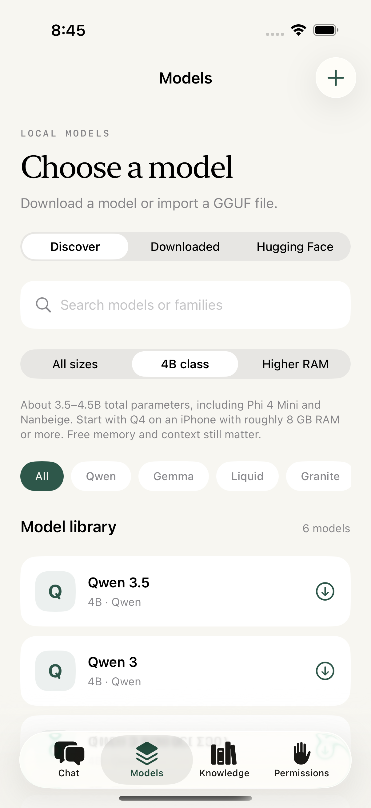

# 4B model tier

Added September 6, 2026. The Models → Discover → **4B class** filter includes the four 4B models below plus Phi 4 Mini (3.8B) and Nanbeige 4.2-3B (about 4.2B including embeddings). Family filters and text search compose with this filter; typing `4b` also searches the parameter label.

| Model | GGUF publisher/repository | Q4_K_M bytes checked | Upstream license |
| --- | --- | ---: | --- |
| Qwen 3.5 4B | [unsloth/Qwen3.5-4B-GGUF](https://huggingface.co/unsloth/Qwen3.5-4B-GGUF) | 2,740,937,888 | Apache-2.0 |
| Qwen 3 4B | [Qwen/Qwen3-4B-GGUF](https://huggingface.co/Qwen/Qwen3-4B-GGUF) | 2,497,280,256 | Apache-2.0 |
| Qwen 3 Instruct 2507 4B | [unsloth/Qwen3-4B-Instruct-2507-GGUF](https://huggingface.co/unsloth/Qwen3-4B-Instruct-2507-GGUF) | 2,497,281,120 | Apache-2.0 |
| Gemma 3 4B | [ggml-org/gemma-3-4b-it-GGUF](https://huggingface.co/ggml-org/gemma-3-4b-it-GGUF) | 2,489,757,856 | Gemma terms |

The live Hugging Face API confirmed single-file Q4_K_M downloads and these revisions, respectively: `e87f176479d0855a907a41277aca2f8ee7a09523`, `bc640142c66e1fdd12af0bd68f40445458f3869b`, `a06e946bb6b655725eafa393f4a9745d460374c9`, and `d0976223747697cb51e056d85c532013931fe52e`. The app reads current sizes and checksums when opening a model, then pins the selected file's revision for the transfer. No 4B weights were downloaded or executed during this catalog check.

**Device guidance, not a compatibility guarantee:** these entries show an approximate 8 GB device-RAM guideline and prefer Q4_K_M. File size is not runtime memory usage. Context, model architecture, app overhead, available RAM, and iOS memory limits also matter. The runtime still checks loading and available memory, and users can choose a smaller model. Vision inputs/projector files are not enabled; Gemma 3 and Qwen 3.5 run in text mode in this app.

Phi 4 Mini remains labeled accurately as **3.8B**, not 4B. The size-class helper accepts numeric parameter labels from 3.5B up to, but not including, 4.5B. Effective-size names such as E2B and unknown Hugging Face sizes are not guessed into this tier. External Hugging Face search is not filtered using unknown sizes.
