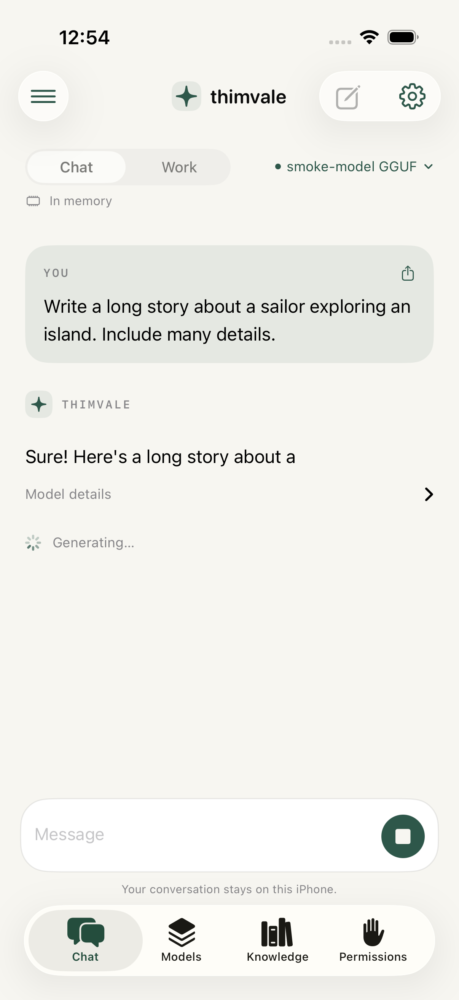
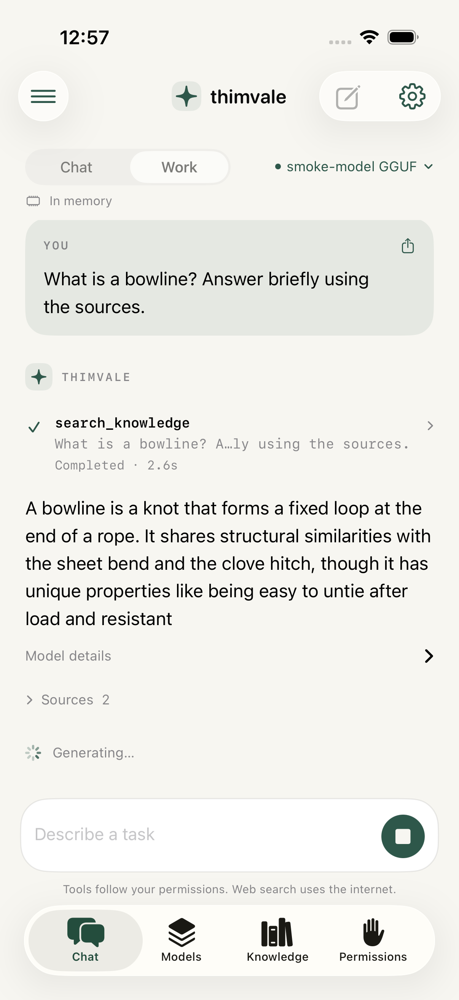
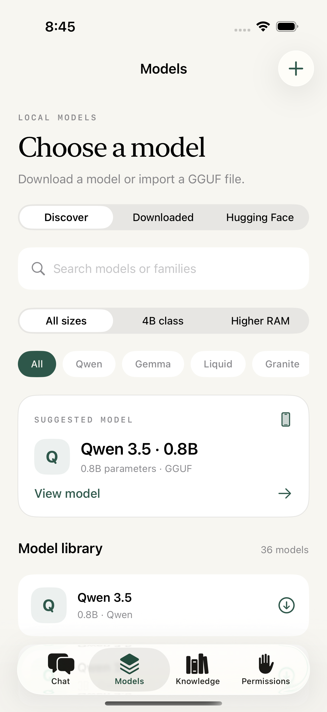

# Thimvale

A native iPhone workspace for local language models, permission-controlled agents, and offline knowledge.

  

## Product

- **Chat:** private, streaming conversations with a downloaded GGUF model.
- **Model memory:** selection preloads weights and reuses them across replies and new conversations. Backgrounding, memory pressure, or five idle minutes release them; the next send reloads automatically.
- **Live activity:** streamed model output in both modes, plus individual Work tool inputs, approval states, results, and errors. See [memory and activity behavior](docs/model-session-and-activity.md).
- **Work:** a bounded agent loop with independently controlled knowledge search, file listing/reading, file creation, and web search. Writes can require an explicit preview and approval.
- **Models:** 39 curated GGUF models, plus Hugging Face search and local import. Families include Gemma, Qwen, Liquid, Granite, Phi, Llama, SmolLM, Mistral, MiniCPM, Nanbeige, Nemotron, AI9Stars, Ling, Falcon, and Ornith.
- **Size filters:** 4B class includes Phi 4 Mini and Nanbeige alongside Gemma 3 and Qwen. Higher RAM separates larger models with roughly 12+ GB device-RAM guidance. See [4B downloads](docs/models-4b.md) and the [14 additions from the mobile benchmark chart](docs/model-expansion.md).
- **Knowledge:** import folders, text and PDFs; retrieve compressed passages with inspectable source citations. Download compressed Wikipedia ZIM archives directly from Kiwix, including English mini and full text editions.
- **Wikipedia reader:** browse article titles, search downloaded packs, read stored articles, and follow local article links without a model. See [offline reader behavior](docs/wikipedia-reader.md).
- **Pack updates:** foreground reconnect checks, a manual update screen, in-app notices, and opt-in local alerts. Downloads require confirmation and keep the previous edition intact. App Store builds use a limited native review request; TestFlight builds do not.

## Development

Requires an Apple Silicon Mac, Xcode 26.1 or later, the iOS simulator runtime, CMake, and XcodeGen. The first bootstrap downloads pinned native libraries and builds the missing llama.cpp simulator slice; allow several minutes.

```sh
cd ios  # from the repository root
brew install xcodegen cmake
./scripts/bootstrap.sh
open Thimvale.xcodeproj
```

Select your Apple development team in Signing & Capabilities to install on a physical iPhone. The checked-in project contains no developer credentials. Simulator builds use CPU inference; devices use Metal. Simulator downloads use a foreground URLSession because some runtimes do not provide the background transfer daemon. Device builds use a background session and persist resumable transfers.

The app targets iOS 18+. There is no hosted inference service, account requirement, or analytics. Models and knowledge archives download only when requested. Network access is needed for downloads and the optional web tools.

With an iPhone simulator already booted, `./scripts/run-simulator.sh` builds, installs, and launches this exact app. Pass its simulator UUID if several are running. Thimvale is native Swift/C++; it does not use React Native, Expo, Metro, or a JavaScript bundle. See the [simulator incident notes](docs/simulator-regressions.md) for the earlier red-screen report.

Thimvale was previously named PocketMind. The owner registered `com.ethanrimes.thimvale` in App Store Connect; the app and release flow now use that bundle ID. It installs separately from the earlier `com.ethanrimes.pocketmind` simulator prototype, whose data has not been deleted or migrated. See the dated [name screening and rename notes](docs/name-screening.md).

## Use

1. In **Models**, select a curated model or search Hugging Face. Review the model card, choose a quantization, and download. Private/gated repositories require a read token in Settings and accepted upstream terms. Single-file GGUF imports are also supported.
2. Open **Chat** and send a message. Use **Work** to enable tools.
3. In **Permissions**, independently configure knowledge search, file listing, file reading, file creation, and web search as Off / Ask / Allow. Connect folders through the Files picker. The app's Exports folder is available in Files. Writes create new files; overwrites and deletion are unavailable to the model.
4. In **Knowledge**, import files or a folder. Supported text formats include TXT, Markdown, HTML, CSV, JSON, and PDFs with selectable text. Search the index directly or ask in Work. Tap a source to inspect the original passage.
5. Browse Wikipedia downloads and choose a topic, abridged English edition, or complete English text without pictures. Actual sizes and checksums come from Kiwix's catalog and Metalink metadata. Download before going offline. Existing indexed ZIM files can also be imported. Choose **Knowledge → Read Wikipedia offline → a downloaded pack** to browse and search articles manually. Tap article links to continue reading; Back returns to your previous page or search.

Web search requires a user-provided Brave Search API key. Queries go directly to Brave. No external inference API is used.

## Validation

```sh
swift test
python3 scripts/check-catalog.py
./scripts/fetch-test-assets.sh  # about 172 MB; test weights and a real Wikipedia archive
xcodebuild -project Thimvale.xcodeproj -scheme Thimvale \
  -destination 'platform=iOS Simulator,name=iPhone 17 Pro' \
  CODE_SIGNING_ALLOWED=NO test
```

Tests cover capability denial, approval and revocation, path traversal, symlinks, overwrite refusal, compression, index updates/deletion, source provenance, real GGUF generation/cancellation, original Wikipedia article retrieval, upstream metadata, downloads and interrupted verification, plus UI navigation and model filtering. The test-assets script pins SHA-256 digests. Large files are excluded from Git. Set the scheme's `THIMVALE_NETWORK_TESTS` to `0` for offline test runs; local inference and archive tests still run when fixtures are present.

GitHub Actions builds the app, fetches the pinned test assets, and runs core, native integration, and simulator UI tests on each push. A newer push cancels older queued/running workflows on the same branch, including `main`, to conserve cloud minutes. Completed or failed test runs save result bundles as workflow artifacts; canceled runs skip that upload. XcodeGen's `project.yml` is the project source of truth; regenerate the checked-in project after changing it.

For automatic signed builds and uploads from `main`, follow the [Apple Developer → GitHub → TestFlight setup](docs/testflight.md). Uploads are disabled until the Apple app record, signing secrets, and repository variables are configured. Passing local builds is not an App Store Connect validation or upload.

Simulator UI regressions use a fresh `THIMVALE_TEST_SESSION` UUID for separate app storage, preferences, and Keychain entries. They never reset the ordinary app library. Real chat and offline-search UI cases import the pinned fixtures through the app's normal import services, with a fixed sampling seed for reproducibility. Test fixture loading and the fixed seed are compiled out of physical-device and Release builds.

## Implementation limits

- This is a working first version, not an App Store release. Physical-device speed, thermal behavior, memory limits, background download scheduling, and accessibility still need device testing. Both device and simulator targets compile locally.
- Thirty-nine curated repositories were checked for single-file GGUF availability and their default quantizations. That does not establish that every architecture and quantization works on every iPhone. The runtime checks templates and model loading and rejects known memory overcommit. Only text generation is implemented; vision, audio, sharded GGUFs, and raw safetensors are not supported.
- Imported English documents use Apple's on-device sentence embeddings when available, compressed to one bit per dimension, plus SQLite FTS5. Other languages still have Unicode keyword search. The app does not download the OS embedding resource itself. If it is unavailable, indexing/search use keywords. Reimport to add vectors after the resource becomes available.
- Sign quantization reduces vector storage by 32x compared with Float32, at a retrieval-quality cost. It is not a 32x reduction of the whole library and is not a claim of optimal compression. Text uses LZFSE; the contentless FTS index avoids retaining another plaintext copy. Libraries over 20,000 passages use lexical candidate selection before vector reranking to bound search time.
- Wikipedia uses the ZIM corpus's compressed article storage and full-text index, with semantic reranking of retrieved passages. It does **not** ship millions of precomputed Wikipedia vectors. Mini editions are abridged; full English text still requires tens of gigabytes. Nothing downloads automatically.
- Import limits: 1,000 supported files per folder operation, 25 MB per file, 500 PDF pages, and 20 MB of extracted text per indexed document. Scanned PDFs need OCR before import. Imports are snapshots, not live folder sync.
- Work executes at most six tool calls per request and blocks repeated loops. Small models may emit malformed tool calls or omit citations. When evidence exists, one answer-only retry can recover an answer; it cannot execute tools. Unconnected folders are rejected before approval. Retrieved sources remain inspectable, and omitted citations or tool failures are reported in the work activity. Tool results are treated as untrusted evidence; permissions are enforced in code.
- Generation stops and the model is unloaded in the background or under memory pressure. Idle weights are also released after five minutes. Activity transcripts and tool previews stay in local conversation history. App data is excluded from backups. Use Share and the Exports folder for material you want to keep. API tokens are kept in device-only Keychain entries.

See [architecture](docs/architecture.md) for storage and capability boundaries, and [validation](docs/validation.md) for the checks performed and their limits.

## Upstream projects

- [llama.cpp](https://github.com/ggml-org/llama.cpp): native GGUF inference (MIT).
- [libzim / Kiwix](https://github.com/kiwix/apple): compressed, indexed Wikipedia archives (GPL-3.0 dependencies).
- [Hugging Face Hub](https://huggingface.co/docs/hub/api): model discovery and downloads. Each model retains its own license; open weights do not necessarily mean OSI-approved open source.

Thimvale source is GPL-3.0-or-later. Model weights and Wikipedia content are separately licensed.
